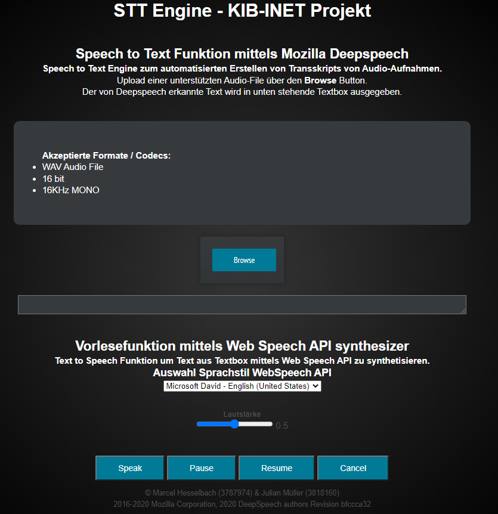

# STT_Webanwendung_htwsaar_INET-Technologien

NodeJS STT Engine with Express, Multer and Deepspeech

Examination performance for the module KIB-INET at the htw saar

## Getting Started

### Development Server
- Clone Git Repository
- Download Deepspeech Model from https://drive.google.com/file/d/1Dt7ddf0QmuckZksw69vCa_bjFElkG5MB/view?usp=sharing  and place/rename it into ./models/deepspeech/model_de.pb (Github doesnt allow File Upload > 100MB)
- Install NodeJS Version 14.x or 15.x
- Install Dependencies
```npm install ```
- Use Nodemon (`nodemon`) or `node server.js` to Start Server
- Server is now available at http://localhost:3000

### Build Server using Docker
- Clone Git Repository
- Download Deepspeech Model from https://drive.google.com/file/d/1Dt7ddf0QmuckZksw69vCa_bjFElkG5MB/view?usp=sharing  and place/rename it into `./models/deepspeech/model_de.pb` (Github doesnt allow File Upload > 100MB)
- Build Image and Container with Dockerfile `docker build -t sttengine .`
- Run Container `docker run -p 3000:3000 sttengine`
- Server is now available at http://localhost:3000

## How to Use

After usage of Getting Started Guide the Webinterface is available at http://localhost:3000



Via Browse Button accepted Files can be uploaded to be processed through Deepspeech SST.

There are two example files (WAV, 16KHZ mono) in `views/examples` Folder.

Generated Text will be printed in Textarea below.

We also implemented the Web Speech API synthesizer which uses local ressources to give a Text to Speech functionality. Textarea's value will be used.


 
## Built with
- [NodeJS](https://nodejs.org) - plattformübergreifende Open-Source-JavaScript-Laufzeitumgebung
- [Mozilla Deepspeech](https://github.com/mozilla/DeepSpeech) - open source embedded (offline, on-device) speech-to-text engine
- [Deepspeech German](https://github.com/AASHISHAG/deepspeech-german) - Automatic Speech Recognition (ASR) - German
- [Express](https://expressjs.com/) - Fast, unopinionated, minimalist web framework for Node.js
- [Multer](https://github.com/expressjs/multer) - Node.js middleware for handling `multipart/form-data`.
